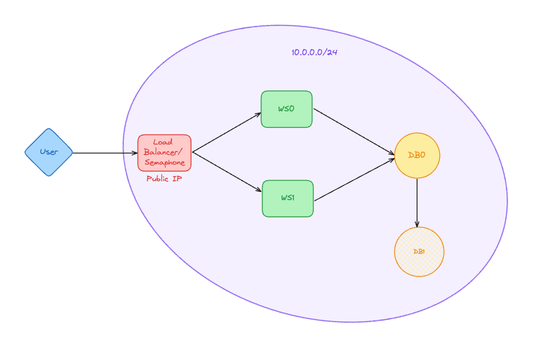
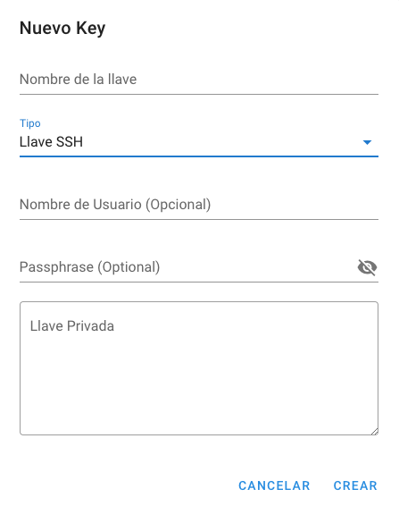
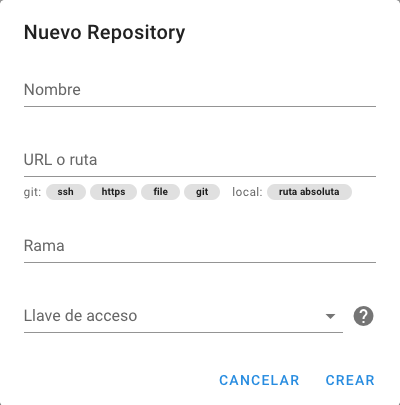
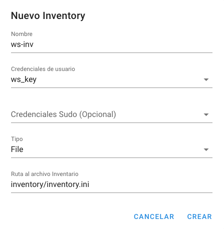
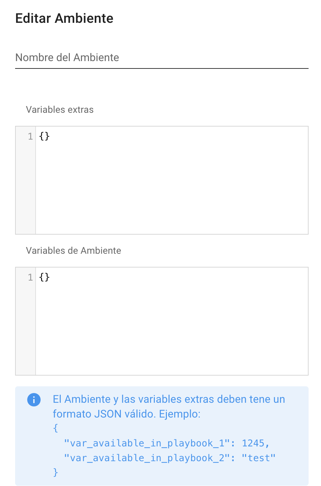
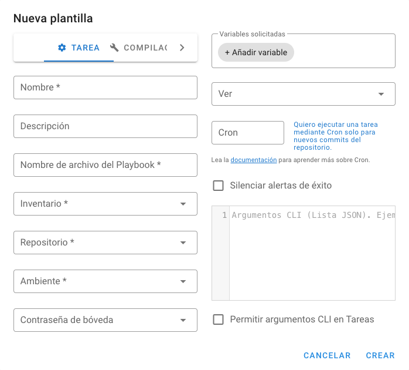
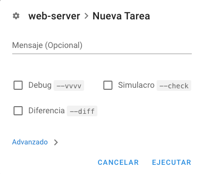

# TPE Redes - Tema 10: Ansible

## Requerimientos mínimos

### Terraform 1.8.4
**MacOS**

```
brew install hashicorp/tap/terraform
```

Link a la página oficial: https://developer.hashicorp.com/terraform/install

### Ansible 2.15.10
```
pip install ansible
```

Link a la página oficial: https://docs.ansible.com/ansible/latest/installation_guide/intro_installation.html

### Azure CLI
**MacOS**

```
brew install azure-cli
```

Link a la página oficial: https://learn.microsoft.com/en-us/cli/azure/install-azure-cli

## Resumen
El objetivo de este proyecto es demostrar el funcionamiento de la herramienta Ansible, utilizándola para orquestar el despliegue de una aplicación sencilla que mantiene un leaderboard con los 10 mejores puntajes de un videojuego. Esta tiene 3 endpoints HTTP:

* **POST /database** - Inicializar la tabla de la base de datos

* **POST /scores** - Agregar una entrada al leaderboard. 

    `Body: { "score": integer, "name": string }`
    
* **GET /leaderboards** - Obtener los 10 mejores scores

Para soportar esta funcionalidad, se van a levantar dos web servers idénticos escritos con Node.js. Estos estarán conectadas a una base de datos relacional PostgreSQL, la cual tendrá una réplica redundante con el objetivo de aumentar la resiliencia y disponibilidad del sistema. Finalmente, se implementará un servidor nginx que acepte el tráfico entrante y lo redirija a los dos servidores web utilizando Round Robin como metodo de balanceo.

[](images/image.png)

### Estrategia

Para ejecutar este sistema, primero se debe ejecutar el playbook `public-config.yml` desde una computadora local. Este playbook descargará todas las dependencias necesarias en la máquina virtual expuesta públicamente, incluido Ansible y Semaphore UI, para luego poder ejecutar el resto de los playbooks desde la subred privada. De esta manera, alcanza con exponer una sola IP pública para tener acceso a toda la infraestructura remota.

## Azure CLI

Para poder utilizar este proyecto, se necesitará una cuenta de Microsoft Azure. Una vez creada la cuenta, instale Azure CLI en su terminal e inicie sesión con el siguiente comando:

```
az login
```

## Terraform

Para la implementación del proyecto, primero es necesario tener la infraestructura deployada. Para lograr esto, se utilizó Terraform resultando en una arquitectura como se muestra a continuación. 

[](images/azure-arch.png)

La creación del código de Terraform puede separarse en tres etapas: la base de la infraestructura, las VMs y los pasos de post procesamiento.

### Base de la Infraestructura
Como en cualquier proyecto en Azure, lo primero que debe crearse es un *resource group*, que es donde se almacenarán todos los recursos creados posteriormente. Para hacerlo, se utilizó el recurso `azurerm_resource_group`, configurando el atributo `name` con el valor *"tpe-redes"* y `location` con *"eastus"*. 

Con este recurso creado, el nombre y la _location_ se utilizarán en varios otros recursos cuando sea necesario. Estos se acceden mediante `azurerm_resource_group.rg.name` y `azurerm_resource_group.rg.location`.

A continuación, se necesita crear una *Virtual Network* donde se puedan deployar las máquinas virtuales. Para esto, se utilizó el recurso `azurerm_virtual_network`, el cual incluye los atributos `resource_group` y `location` obtenidos del recurso anterior, además de `name` con el valor *"tpe-network"* y `address_space` con *10.0.0.0/16*. Asimismo, se creó la subred default para esta Virtual Network utilizando el recurso `azurerm_subnet`, con `address_prefixes` configurado como *10.0.0.0/24*.

### Las Virtual Machines

Para el proyecto se necesitaron deployar 5 máquinas virtuales:

- Dos para levantar los servidores web, que de ahora en más llamaremos **ws_vms**.
- Una para levantar la base de datos primaria y otra para la secundaria, que llamaremos **db_vms**.
- Una para levantar el load balancer y además configurar Semaphore, que llamaremos **public_vm**.

Para todas las máquinas virtuales se utilizó el recurso `azurerm_linux_virtual_machine` con el `size` configurado como *"Standard_F2"* para **public_vm** y *"Standard_B1ls"* para las demás. En todas se configuró el `admin_username` como *"azureuser"* y se utilizaron los siguientes bloques de `source_image_reference` y `os_disk`:

```hcl
os_disk {
    caching              = "ReadWrite"
    storage_account_type = "Standard_LRS"
}
  
source_image_reference {
    publisher = "Canonical"
    offer     = "0001-com-ubuntu-server-jammy"
    sku       = "22_04-lts"
    version   = "latest"
}
```

Para configurar el acceso a las VMs, se utilizó un recurso llamado `tls_private_key` del proveedor *tls* para crear claves SSH específicas para cada tipo de VM (__ws_vms__, __db_vms__ y __public_vm__). Una vez creado el recurso, se asigno el`tls_private_key.ssh.public_key_openssh` correspondiente para cada tipo de VM al atributo `public_key` del bloque `admin_ssh_key`.

Además, para cada tipo de VM fue necesario crear una Network Interface. Esto se hizo utilizando el recurso `azurerm_network_interface` asignando al atributo `subnet_id` del bloque `ip_configuration` el id de la subnet default creada anteriormente. Para la __public_vm__, en el bloque `ip_configuration`, se añadió el `public_ip_address_id` con el ID que es el resultado del recurso `azurerm_public_ip`.

Por último, se creó para cada tipo de VM un Network Security Group utilizando el recurso `azurerm_network_security_group`. Para los tres NSG, se habilitó el puerto `22` para las conexiones SSH. Sin embargo, en el NSG de __public_vm__, el `source_address_prefix` se configuró en _"*"_, mientras que en los otros se configuró en *10.0.0.0/24*. Esto asegura que solo las solicitudes provenientes de la subred default puedan acceder a __ws_vms__ y __db_vms__ por SSH.

Luego, se habilitó el puerto `3000` tanto para __public_vm__ como para __ws_vms__, donde en estas últimas el `source_address_prefix` también se limitó a la subred default. En __public_vm__, este puerto expone la interfaz de Semaphore, y en __ws_vms__ expone el servidor web.

Para __db_vms__, se habilitó el puerto `5432`, atribuyendo a `source_address_prefix` el rango de IPs de la subred default, asegurando que solo las conexiones dentro de la misma subred puedan acceder a la base de datos.

Por último, se habilitó el puerto `8080` para __public_vm__ con cualquier origen (`source_address_prefix` configurado en _"*"_) para permitir el acceso a través del load balancer al servidor web.

Todas estas configuraciones de reglas se realizan utilizando el bloque `security_rule` dentro de el recurso `azurerm_network_security_group`, como se muestra a continuación con el ejemplo de *Allow3000* para las __ws_vms__:

```hcl
security_rule {
    name                 = "Allow3000"
    priority             = 1001
    direction            = "Inbound"
    access               = "Allow"
    protocol             = "Tcp"
    source_port_range    = "*"
    destination_port_range = "3000"
    source_address_prefix = "10.0.0.0/24"
    destination_address_prefix = "*"
}
```

### Post Procesamiento

Por último, se utilizó el proveedor *local* para utilizar el recurso `local_file`. Con este recurso, se logran crear archivos que son necesarios para la ejecución de los playbooks de Ansible. Primero, se crean tres archivos dentro del directorio `keys`. Estos archivos son:

- `private.pem`, que contiene la llave privada creada con `tls_private_key` para la configuración SSH de **public_vm**.
- `db_private.pem`, que contiene la llave privada creada con `tls_private_key` para la configuración SSH de **db_vms**.
- `ws_private.pem`, que contiene la llave privada creada con `tls_private_key` para la configuración SSH de **ws_vms**.

Luego, se crea el inventario dentro del directorio correspondiente con todas las IPs de las VMs creadas con el siguiente código:

```hcl
resource "local_file" "inventory" {
  content  = <<-EOT
    [public]
    ${azurerm_public_ip.public_ip.ip_address} ansible_ssh_private_key_file="keys/private.pem"

    [ws]
    ${azurerm_linux_virtual_machine.vms_ws[0].private_ip_address} ansible_ssh_private_key_file="keys/ws_private.pem"
    ${azurerm_linux_virtual_machine.vms_ws[1].private_ip_address} ansible_ssh_private_key_file="keys/ws_private.pem"

    [db]
    ${azurerm_linux_virtual_machine.vms_db[0].private_ip_address} ansible_ssh_private_key_file="keys/db_private.pem" primary=true
    ${azurerm_linux_virtual_machine.vms_db[1].private_ip_address} ansible_ssh_private_key_file="keys/db_private.pem" secondary=true

  EOT
  filename = "../inventory/inventory.ini"
}
```

### Error de IP Pública

Las Dynamic Public IP Addresses no se asignan hasta que están adjuntas a un dispositivo, por lo que en la primera ejecución del `terraform apply`, el output de `azurerm_public_ip.public_ip.ip_address` queda vacío. Por lo tanto, es necesario volver a ejecutar `terraform apply` para que se cree el archivo `inventory.ini` correctamente.

## Ansible

### Inventory
Dentro del archivo `inventory.ini`, para cada una de las Virtual Machines se especifica:
- Nombre del grupo de hosts, que deberá coincidir con la propiedad `hosts` del playbook
- IP y una variable `ansible_ssh_private_key_file` con el path a su llave privada

El formato es el siguiente:

```ini
[public]
<IP> ansible_ssh_private_key_file="keys/public.pem"

[ws]
<IP> ansible_ssh_private_key_file="keys/ws_public.pem"
<IP> ansible_ssh_private_key_file="keys/ws_public.pem"

[db]
<IP> ansible_ssh_private_key_file="keys/db_public.pem" primary=true
<IP> ansible_ssh_private_key_file="keys/db_public.pem" secondary=true
```

### Templates

Se empleará Jinja para los archivos de configuración de Nginx y PostgreSQL. En el caso de PostgreSQL, se ha optado por separar la configuración en dos archivos distintos: uno para definir cómo se ejecutará el servicio (incluyendo puertos y el número máximo de conexiones) y otro para gestionar la configuración de usuarios y accesos.

### Playbooks
En todos los playbooks, se deberá especificar:
- `name`: Nombre del playbook
- `hosts`: grupo de hosts
- `become`: `true`
- `remote_user`: `azureuser`
- `vars`: Las variables utilizadas en el playbook
- `tasks`: Lista de tareas que se ejecutarán en los hosts especificados.

#### <u>public-config.yml</u>

Este playbook tiene como objetivo principal configurar una máquina virtual pública con una serie de componentes necesarios para su funcionamiento. Comienza instalando `Semaphore`, una plataforma de integración y entrega continua, utilizando `Snap`, un gestor de paquetes. Luego, verifica si existe un usuario específico en Semaphore. En caso de que no exista, crea un usuario administrador con las credenciales especificadas, como nombre de usuario, correo electrónico y contraseña.

A continuación, se asegura de que `NGINX`, un servidor web y balanceador de carga, esté instalado y actualizado en la máquina virtual. Esto incluye iniciar el servicio NGINX y habilitarlo para que se ejecute automáticamente en el arranque del sistema. Además, despliega una configuración personalizada de NGINX desde una template y elimina la configuración predeterminada para evitar conflictos. Finalmente, reinicia el servicio NGINX para aplicar los cambios realizados.

Después de configurar NGINX, el playbook procede a instalar paquetes necesarios en el sistema, como `Python 3` y `pip`, el gestor de paquetes de Python. Luego, utiliza pip para instalar `Ansible` y `Ansible Core`.

Además de instalar Ansible localmente, el playbook descarga la colección `community.general` de Ansible Galaxy, que contiene módulos y plugins adicionales para Ansible. Este paso es necesario para que al correr los otros plybooks dentro de esta máquina virtual, tenga los módulos necesarios para las configuraciones de PostgreSQL.

Por último, el playbook copia el código del proyecto desde un directorio local a la máquina virtual. Esto garantiza que todos los archivos y recursos necesarios para el proyecto estén disponibles en el entorno de la máquina virtual. Además, ajusta los permisos de ciertos archivos clave, como archivos .pem, para garantizar la seguridad y limitar el acceso solo al propietario de la máquina virtual.


#### <u>ws-config.yml</u>

Este playbook tiene como objetivo principal configurar un servidor web para ejecutar una aplicación basada en node.js. Comienza actualizando el caché de paquetes del sistema utilizando el comando `apt-get update`. Luego, instala los paquetes necesarios para el entorno de ejecución de Node.js, incluyendo Node.js y npm, utilizando el gestor de paquetes apt. Después de instalar los paquetes, copia el código de la aplicación del servidor web desde un directorio local al servidor remoto utilizando el módulo copy de Ansible.

Una vez que el código de la aplicación está en el servidor, el playbook ejecuta el comando `npm install` dentro del directorio de la aplicación para instalar todas las dependencias necesarias para su funcionamiento. Posteriormente, se configura un servicio de systemd personalizado para la aplicación Node.js, que define cómo debe iniciarse, detenerse y reiniciarse la aplicación, así como las variables de entorno necesarias para su ejecución.

Después de desplegar el archivo de servicio de systemd, el playbook ejecuta el comando `systemctl daemon-reload` para recargar systemd y aplicar los cambios realizados en el archivo de servicio. Finalmente, habilita y arranca el servicio de la aplicación Node.js, asegurando que la aplicación esté disponible y se ejecute correctamente en el servidor web. Si hay cambios importantes que requieren reiniciar el servicio, se define un handler para reiniciar el servicio de manera automática.

#### <u>db-config.yml</u>

Este playbook se encarga de configurar un servidor `PostgreSQL` en dos máquinas virtuales, una para tener la base de datos primaria y en la otra la secunda.

Primero, establece variables que contienen información clave, como la ubicación de los directorios de datos y configuración de `PostgreSQL`, así como credenciales de usuario y contraseña. Luego, realiza una serie de tareas para preparar el entorno. Esto incluye agregar el repositorio de `PostgreSQL`, instalar el software necesario, como el servidor y cliente `PostgreSQL`, y configurar el servicio para que se inicie automáticamente.

Después, se crea el directorio de datos de `PostgreSQL` y se establecen los permisos adecuados. Se inicializa el directorio de datos y se despliegan archivos de configuración personalizados, como `postgresql.conf` y `pg_hba.conf`, para adaptar la configuración del servidor a las necesidades específicas.

Se crean una base de datos y un usuario dentro de `PostgreSQL`, con los permisos necesarios para su funcionamiento. También se configuran reglas de firewall para permitir conexiones entrantes a los puertos relevantes. Además, se configuran usuarios y permisos para la replicación de datos entre servidores `PostgreSQL`.

Finalmente, se realizan acciones específicas en servidores secundarios, como detener `PostgreSQL`, limpiar el directorio de datos y realizar una copia de seguridad de la base de datos desde el servidor principal.

El playbook también define handlers para reiniciar y recargar el servicio `PostgreSQL`, en caso de que se realicen cambios en la configuración que requieran estas acciones.

### Modules

A continuación se puede ver una tabla con todos los módulos utilizados en los playbooks del proyecto:

| Nombre del Módulo                   | Descripción                                                     | Playbook               |
|-------------------------------------|-----------------------------------------------------------------|------------------------|
| `ansible.builtin.apt`               | Gestiona paquetes en sistemas basados en APT, permitiendo instalar, eliminar y actualizar paquetes | `public-config.yml`, `db-config.yml`, `ws-config.yml` |
| `ansible.builtin.apt_key`           | Gestiona las claves APT para los repositorios                   | `db-config.yml`        |
| `ansible.builtin.command`           | Ejecuta comandos en sistemas remotos sin utilizar un shell, adecuado para comandos sencillos | `public-config.yml`, `db-config.yml`, `ws-config.yml` |
| `ansible.builtin.copy`              | Copia archivos a los hosts gestionados, permitiendo especificar permisos y propietarios del archivo | `public-config.yml`, `ws-config.yml` |
| `ansible.builtin.file`              | Gestiona archivos y directorios, permitiendo crear, eliminar y cambiar permisos y propietarios | `public-config.yml`, `db-config.yml`, `ws-config.yml` |
| `ansible.builtin.lineinfile`        | Gestiona líneas en archivos de texto, permitiendo agregar, modificar o eliminar líneas específicas | `db-config.yml`        |
| `ansible.builtin.pip`               | Gestiona paquetes de Python usando `pip`, permitiendo instalar, actualizar y eliminar paquetes | `public-config.yml`        |
| `ansible.builtin.service`           | Gestiona servicios del sistema usando scripts de inicio tradicionales o `systemd` | `public-config.yml`, `db-config.yml` |
| `ansible.builtin.set_fact`          | Establece variables como hechos, permitiendo su uso en tareas posteriores | `db-config.yml`        |
| `ansible.builtin.shell`             | Ejecuta comandos en sistemas remotos usando un shell            | `db-config.yml`        |
| `ansible.builtin.systemd`           | Gestiona servicios del sistema usando `systemd`, permitiendo iniciar, detener, habilitar y reiniciar servicios | `public-config.yml`, `db-config.yml`, `ws-config.yml` |
| `ansible.builtin.template`          | Gestiona archivos de templates, permitiendo copiar ese tipo de archivos y reemplazar variables dentro de ellos | `public-config.yml`, `db-config.yml` |
| `community.general.snap`            | Gestiona paquetes Snap, permitiendo instalar, eliminar y actualizar aplicaciones Snap | `public-config.yml`        |
| `community.general.ufw`             | Gestiona reglas de firewall usando UFW (Uncomplicated Firewall), permitiendo agregar o eliminar reglas de firewall | `db-config.yml`        |
| `community.postgresql.postgresql_db`| Gestiona bases de datos de PostgreSQL, permitiendo crear, eliminar y modificar bases de datos | `db-config.yml`        |
| `community.postgresql.postgresql_privs`| Gestiona privilegios en PostgreSQL, permitiendo otorgar o revocar permisos en bases de datos y esquemas | `db-config.yml`        |
| `community.postgresql.postgresql_user`| Gestiona usuarios de PostgreSQL, permitiendo crear, eliminar y modificar usuarios y sus permisos | `db-config.yml`        |


## Semaphore UI
Semaphore UI es una herramienta open-source para gestionar y ejecutar playbooks de Ansible. Para correr un playbook en esta plataforma, se deben seguir las siguientes instrucciones:
1. En caso de acceder al repositorio de Git con las llaves SSH, subir la llave privada a la tienda de llaves.

    [](images/semui-create-key.png)
2. Conectar el repositorio a la plataforma y completar:
    - Nombre
    - Link al repositorio
    - Branch a utilizar
    - Credenciales para acceder al repositorio. Las opciones son:
        - SSH
        - None: En caso de usar HTTPS

    [](images/semui-create-repository.png)
3. Agregar el inventory mediante el path al archivo de inventory o definiendo los grupos y variables en el campo de texto.

    [](images/semui-create-inventory.png)
4. Crear un environment (en este caso, estará vacío)

    [](images/semui-create-environment.png)
5. Crear una tarea para la ejecución del playbook y completar:
    - Nombre de la tarea
    - Path al playbook en el repositorio
    - Inventory
    - Nombre de repositorio
    - Environment
    - Argumentos:
        - Llave privada: para el acceso a la Virtual Machine.

    [](images/semui-create-template.png)
5. Ejecutar la tarea creada en el anterior paso.

    [](images/semui-run-task.png)

Al finalizar la ejecución, se mostrará el resultado de correr el playbook.

## Ejecución

### Deployar la Infraestructura
Primero se debe deployar la infraestructura donde se van a encontrar los hosts remotos del inventory de los playbooks de Ansible. Para esto, se deben correr los siguientes comandos ubicado en la carpeta raíz del proyecto:

```shell
cd terraform
terraform plan
terraform apply -auto-approve
```

> Nota: el output del `terraform plan` debe verificarse para confirmar los recursos que se deployarán.

Como se aclaró antes, para que la IP pública se copie bien en el inventory, se debe volver a correr el `terraform apply --auto-approve`.

### Git Push

Para poder tener el repositorio actualizado con las llaves privadas y el inventory creado, se debe correr desde el directorio root:

```shell
git push
```

Esto permitirá que al clonar el repo dentro de la VM Pública, esten disponibles todos los archivos necesarios.

### Configurar VM Pública

Para configurar la VM pública donde van a estar el Load Balancer (expuesto en el puerto 8080) y Semaphore (en el puerto 3000), se debe ejecutar en el directorio root el playbook `public-config.yml` de la siguiente manera:

```shell
ansible-playbook [-vvvv] --private-key=./keys/private.pem -i ./inventory/inventory.ini ./playbooks/public-config.yml
```

Con este playbook, van a quedar configurados los requerimientos para poder correr los otros playbooks desde allí. 

### Configurar Webserver and Database VMs

Para poder configurar las VMs donde va a estar corriendo el webserver y la base de datos, se debe acceder a la VM pública por SSH con el siguiente comando desde el directorio root:

```shell
ssh -i keys/private.pem azureuser@[public_ip]
```

Una vez dentro solamente hay que correr:

```shell
cd tpe-redes
sudo ansible-playbook [-vvvv] --private-key=./keys/ws_private.pem -i inventory/inventory.ini playbooks/ws-config.yml
sudo ansible-playbook [-vvvv] --private-key=./keys/db_private.pem -i inventory/inventory.ini playbooks/db-config.yml
```

> Obs: La ejecución del playbook es bastante larga.

> Nota: Se recomienda intentar acceder a los hosts remotos de los grupos _ws_ y _db_ antes de correr los playbooks para que no aparezca el mensaje interactivo _"The authenticity of host '10.0.0.* (10.0.0.*)' can't be established."_, lo que resulta en una incomodidad a la hora de correr el playbook.  También se podrían agregar las IPs al archivo `authorized_hosts`.

### Destruir la Infrastructura
Para destruir la infrastructura, se deben ejecutar los siguientes comandos:

```shell
terraform destroy
terraform destroy
```

> Nota: el comando `terraform destroy` se debe ejecutar dos veces debido a un problema en la secuencia de los recursos. En el momento en que se intenta de eliminar la IP pública, esta sigue estando en uso y, por lo tanto, causa un error. Por eso, se debe correr una segunda vez este comando para eliminar por completo todos los recursos.