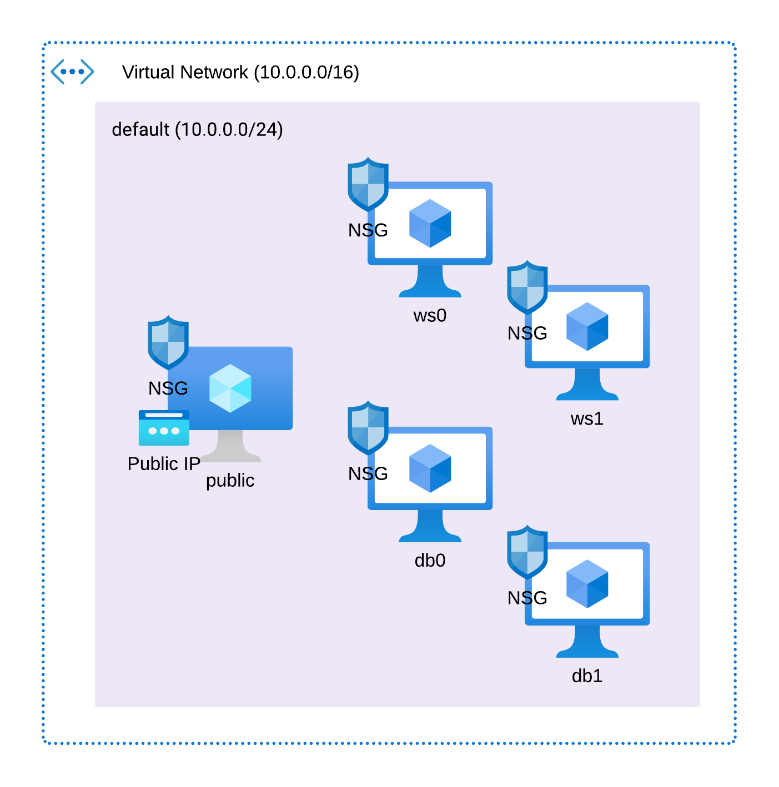
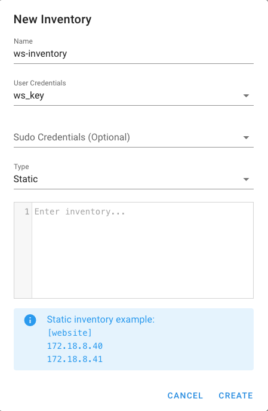

# TPE Redes - Tema 10: Ansible

## Requerimientos mínimos

### Ansible 2.15.10
**MacOS**

`brew install hashicorp/tap/terraform`

Link a la página oficial: https://developer.hashicorp.com/terraform/install

### Terraform 1.8.4
`pip install ansible`

Link a la página oficial: https://docs.ansible.com/ansible/latest/installation_guide/intro_installation.html

## Resumen
El objetivo de este proyecto es demostrar el funcionamiento de la herramienta Ansible, utilizándola para orquestar el despliegue de una aplicación sencilla que mantiene un leaderboard con los 10 mejores puntajes de un videojuego. Esta tiene 3 endpoints HTTP:

### POST /database - Inicializar la tabla de la base de datos

### POST /scores - Agregar una entrada al leaderboard. 

`Body: { "score": integer, "name": string }`
    
### GET /leaderboards - Obtener los 10 mejores scores

Para soportar esta funcionalidad, se van a levantar dos web servers identicos escritos con node.js. Estos estarán conectadas a una base de datos relacional PostgreSQL, la cual tendrá una réplica redundante con el objetivo de aumentar la resiliencia y disponibilidad del sistema. Finalmente, se implementará un servidor nginx que acepte el tráfico entrante y lo redirija a los dos servidores web utilizando Round Robin como metodo de balanceo.

[](images/image.png)

### Estrategia

Para ejecutar este sistema, primero se debe ejecutar el playbook `public-config.yml` desde una computadora local. Este playbook descargará todas las dependencias necesarias en la máquina virtual expuesta públicamente, incluido Ansible y Semaphore UI, para luego poder ejecutar el resto de los playbooks desde la subred privada. De esta manera, alcanza con exponer una sola IP publica para tener acceso a toda la infraestructura remota.

## Terraform

Para la implementación del proyecto, primero es necesario tener la infraestructura deployada. Para lograr esto, se utilizo Terraform resultando en una arquitectura como se muestra a continuación. 

[](images/azure-arch.png)

La creacion del codigo de Terraform puede separarse en tres etapas: la base de la infraestructura, las VMs y los pasos de post procesamiento

### Base de la Infraestructura
Como en cualquier proyecto en Azure, lo primero que debe crearse es un resource group, que es donde se almacenarán todos los recursos creados posteriormente. Para hacerlo, se utilizó el recurso `azurerm_resource_group`, configurando el atributo `name` con el valor *"tpe-redes"* y `location` con *"eastus"*. 

Con este recurso creado, el nombre y la location se utilizarán en varios otros recursos cuando sea necesario. Estos se acceden mediante `azurerm_resource_group.rg.name` y `azurerm_resource_group.rg.location`.

A continuación, se necesita crear una Virtual Network donde se puedan deployar las máquinas virtuales. Para esto, se utilizó el recurso `azurerm_virtual_network`, el cual incluye los atributos `resource_group` y `location` obtenidos del recurso anterior, además de `name` con el valor *"tpe-network"* y `address_space` con *10.0.0.0/16*. Asimismo, se creó la subred default para esta Virtual Network utilizando el recurso `azurerm_subnet`, con `address_prefixes` configurado como *10.0.0.0/24*.

### Las Virtual Machines

Para el proyecto se necesitaron desplegar 5 máquinas virtuales:

- Dos para levantar los servidores web, llamadas **ws_vms**.
- Una para levantar la base de datos primaria y otra para la secundaria, llamadas **db_vms**.
- Una para levantar el load balancer y además configurar Semaphore, llamada **public_vm**.

Para todas las máquinas virtuales se utilizó el recurso `azurerm_linux_virtual_machine` con el tamaño `size` configurado como *"Standard_F2"* para **public_vm** y *"Standard_B1ls"* para las demás. En todas se configuró el `admin_username` como *"azureuser"* y se utilizaron los siguientes bloques de `source_image_reference` y `os_disk`:

```hcl
os_disk {
    caching              = "ReadWrite"
    storage_account_type = "Standard_LRS"
}
  
source_image_reference {
    publisher = "Canonical"
    offer     = "0001-com-ubuntu-server-jammy"
    sku       = "22_04-lts"
    version   = "latest"
}
```

Para configurar el acceso a las VMs, se utilizó un recurso llamado `tls_private_key` del proveedor *tls* para crear claves SSH específicas para cada tipo de VM (__ws_vms__, __db_vms__ y __lb_vm__). Una vez creado el recurso, se referenció en el bloque `admin_ssh_key`, atributo `public_key`, utilizando `tls_private_key.ssh.public_key_openssh`.

Además, para cada tipo de VM fue necesario crear una Network Interface. Esto se hizo utilizando el recurso `azurerm_network_interface` con la `ip_configuration`, marcando el `subnet_id` correspondiente creado anteriormente. Para la __lb_vm__, en el bloque `ip_configuration`, se añadió el `public_ip_address_id` con el ID que es el resultado del recurso `azurerm_public_ip`.

Por último, se creó para cada tipo de VM un Network Security Group utilizando el recurso `azurerm_network_security_group`. Para los tres NSG, se habilitó el puerto `22` para las conexiones SSH. Sin embargo, en el NSG de __lb_vm__, el `source_address_prefix` se configuró en _"*"_, mientras que en los otros se configuró en *10.0.0.0/24*. Esto asegura que solo las solicitudes provenientes de la subred predeterminada puedan acceder a __ws_vms__ y __db_vms__ por SSH.

Luego, se habilitó el puerto `3000` tanto para __lb_vm__ como para __ws_vms__, donde en estas últimas el source_address_prefix también se limitó a la subred predeterminada. En __lb_vm__, este puerto expone la interfaz de Semaphore, y en __ws_vms__ expone el servidor web.

Para __db_vms__, se habilitó el puerto `5432`, con source_address_prefix configurado en la subred predeterminada, asegurando que solo las conexiones dentro de la misma subred puedan acceder a la base de datos.

Por último, se habilitó el puerto `8080` para __lb_vm__ con cualquier origen (source_address_prefix configurado en _"*"_) para permitir el acceso a través del balanceador de carga al servidor web.

Todas estas configuraciones de reglas se realizan utilizando el bloque `security_rule` dentro de el recurso `azurerm_network_security_group`, como se muestra a continuación con el ejemplo de Allow3000 para las ws_vms:

```hcl
security_rule {
    name                 = "Allow3000"
    priority             = 1001
    direction            = "Inbound"
    access               = "Allow"
    protocol             = "Tcp"
    source_port_range    = "*"
    destination_port_range = "3000"
    source_address_prefix = "10.0.0.0/24"
    destination_address_prefix = "*"
}
```

### Post Procesamiento

Por ultimo se utilizo el provider __"local"__ para utilizar el recurso `local_file`. Con este recurso, se logra crear archivos que son necesarios para la ejecucion de los playbooks de Ansible. Primero se crean tres archivos dentro del directorio keys. Estos archivos son:

- private.pem, que contiene la llave privada que se creo con `tls_private_key` para la configuración ssh de __lb_vm__
- db_private.pem, que contiene la llave privada que se creo con `tls_private_key` para la configuración ssh de __db_vms__
- ws_private.pem, que contiene la llave privada que se creo con `tls_private_key` para la configuración ssh de __ws_vms__

Luego, se crea el inventorio dentro del diretorio correspondiente con todas las IPs de las VMs creadas con el siguiente codigo:

```hcl
resource "local_file" "inventory" {
  content  = <<-EOT
    [public]
    ${azurerm_public_ip.public_ip.ip_address} ansible_ssh_private_key_file="keys/private.pem"

    [ws]
    ${azurerm_linux_virtual_machine.vms_ws[0].private_ip_address} ansible_ssh_private_key_file="keys/ws_private.pem"
    ${azurerm_linux_virtual_machine.vms_ws[1].private_ip_address} ansible_ssh_private_key_file="keys/ws_private.pem"

    [db]
    ${azurerm_linux_virtual_machine.vms_db[0].private_ip_address} ansible_ssh_private_key_file="keys/db_private.pem"
    ${azurerm_linux_virtual_machine.vms_db[1].private_ip_address} ansible_ssh_private_key_file="keys/db_private.pem"

  EOT
  filename = "../inventory/inventory.ini"
}
```

### Error de IP Pública

Las Dynamic Public IP Addresses no se asignan hasta que están adjuntas a un dispositivo, por lo que en la primera ejecución del apply, el output de azurerm_public_ip.public_ip.ip_address queda vacío. Por lo tanto, es necesario volver a ejecutar terraform apply para que se cree el archivo `inventory.ini` correctamente.

## Ansible

### Inventory
Dentro del archivo `inv.ini`, para cada una de las Virtual Machines se especifica:
- Nombre del grupo de hosts, que deberá coincidir con la propiedad `hosts` del playbook
- IP y una variable 
- `ansible_ssh_private_key_file` con el path a su llave privada

El formato es el siguiente:

```ini
[public]
<IP> ansible_ssh_private_key_file="keys/public.pem"

[ws]
<IP> ansible_ssh_private_key_file="keys/ws_public.pem"
<IP> ansible_ssh_private_key_file="keys/ws_public.pem"

[db]
<IP> ansible_ssh_private_key_file="keys/db_public.pem" primary=true
<IP> ansible_ssh_private_key_file="keys/db_public.pem" secondary=true
```

### Templates

Se empleará Jinja para los archivos de configuración de Nginx y PostgreSQL. En el caso de PostgreSQL, se ha optado por separar la configuración en dos archivos distintos: uno para definir cómo se ejecutará el servicio (incluyendo puertos y el número máximo de conexiones) y otro para gestionar la configuración de usuarios y accesos.

### Playbooks
En todos los playbooks, se deberá especificar:
- `name`: Nombre del playbook
- `hosts`: grupo de hosts
- `become`: `true`
- `remote_user`: `azureuser`
- `vars`: Las variables utilizadas en el playbook
- `tasks`: Lista de tareas que se ejecutarán en los hosts especificados.

#### public-config.yml 


## Semaphore UI
Semaphore UI es una herramienta open-source para gestionar y ejecutar playbooks de Ansible. Para correr un playbook en esta plataforma, se deben seguir las siguientes instrucciones:
1. En caso de acceder al repositorio de Git con las llaves SSH, subir la llave privada a la tienda de llaves.

    [](images/semui-create-key.png)
2. Conectar el repositorio a la plataforma y completar:
    - Nombre
    - Link al repositorio
    - Branch a utilizar
    - Credenciales para acceder al repositorio. Las opciones son:
        - SSH
        - None: En caso de usar HTTPS

    [](images/semui-create-repository.png)
3. Agregar el inventary mediante el path al archivo de inventario o definiendo los grupos y variables en el campo de texto.

    [](images/semui-create-inventory.png)
4. Crear un ambiente (en este caso, estará vacío)

    [](images/semui-create-environment.png)
5. Crear una tarea para la ejecución del playbook y completar:
    - Nombre de la tarea
    - Path al playbook en el repositorio
    - Inventory
    - Nombre de repositorio
    - Ambiente
    - Argumentos:
        - Llave privada: para el acceso a la Virtual Machine.

    [](images/semui-create-template.png)
5. Ejecutar la tarea creada en el anterior paso.

    [](images/semui-run-task.png)

Al finalizar la ejecución, se mostrará el resultado de correr el playbook.